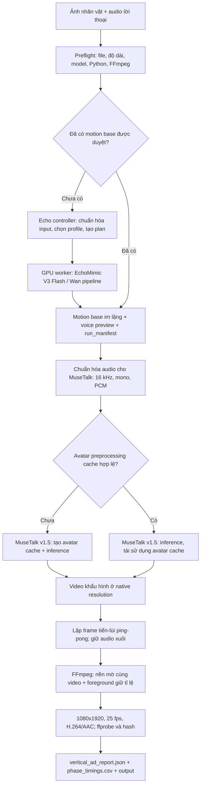

# Báo cáo triển khai core tạo video vào ứng dụng

**Ngày chốt baseline:** 10/10/2026
**Phạm vi:** giữ nguyên thuật toán EchoMimic V3 Flash → MuseTalk hiện tại; báo cáo cách bọc core này bằng UI để có thể triển khai ứng dụng theo từng bước. Đây là báo cáo kỹ thuật, không thay đổi thuật toán hay cấu hình inference.

## Tóm tắt điều hành

Core hiện có một pipeline Windows chạy được qua CLI/batch. FE ứng dụng đã có trên nhánh `develop/quanph/v1.0.0`; các script Echo Flash → MuseTalk dọc nay cũng được đưa vào nhánh này, nhưng job runner của FE vẫn gọi luồng LivePortrait/torso/MuseTalk cũ. Người dùng vẫn chạy pipeline Echo mới bằng CMD cho tới khi bridge/UI được nối. Phần giao diện WanGP là sản phẩm độc lập, không điều khiển pipeline này.

Luồng đang được dùng tạo motion base có lời nói bằng EchoMimic V3 Flash từ ảnh nhân vật và audio; MuseTalk v1.5 dựng khẩu hình theo cùng audio; ảnh chuyển động được lặp tiến/lùi để phủ hết lời thoại; FFmpeg đóng gói video 9:16 1080×1920, 25 fps. Với base A10 512×640 dài 5,16 giây, một chu kỳ tiến-lùi danh nghĩa dài 10,32 giây. Lời thoại không bị lặp.

Các phép đo RTX 3060 do người dùng cung cấp cho thấy sinh motion base A10 dài 5,16 giây mất khoảng 667,5 giây; MuseTalk cho audio thực dài khoảng 55,52 giây khi tái sử dụng avatar cache mất 124,31 giây ở backend và 133,7 giây tính cả MuseTalk + xuất HD. Cộng hai phép đo riêng cho một lượt tạo mới ra khoảng 13 phút 21 giây, nhưng đó chỉ là phép cộng tham khảo, không phải benchmark end-to-end được đo trong cùng job. Khi tái sử dụng cùng motion base/avatar cache cho audio mới, phần Echo được bỏ qua; lượt MuseTalk 55,52 giây đã đo khoảng 2 phút 14 giây.

## 1. Phần đã có và phần chưa có

| Hạng mục | Trạng thái hiện tại |
|---|---|
| Sinh cử động từ ảnh + audio | Có trong `scripts/echo_flash_windows.py` và GPU worker `scripts/echo_flash_backend.py`; dùng profile `A10` làm clip 5,16 giây trong lượt đo gần nhất. |
| Khớp khẩu hình và tái sử dụng avatar preprocessing | Có trong `scripts/test_cached_musetalk.py`; cache được định danh bằng dấu vân tay của motion base, model/source MuseTalk và các tham số xử lý. |
| Lặp chuyển động cho audio dài | Có chế độ `pingpong`, yêu cầu rõ trong lệnh. Video đi xuôi rồi đảo ngược; audio vẫn đi xuôi một lần. |
| Xuất dọc và kiểm tra file | Có trong `scripts/test_vertical_ads.py`; tạo 1080×1920/25 fps, H.264, yuv420p và AAC hoặc copy audio AAC. Sau encode dùng `ffprobe` kiểm chứng. |
| Theo dõi tiến trình, log, timing và manifest | Có ở dạng stdout/log cùng JSON/CSV trên đĩa; chưa có hợp đồng sự kiện ổn định dành cho frontend. |
| UI tạo job, queue, Assets, Hardware, Settings và event bridge | Đã có trên cùng nhánh ứng dụng, nhưng chưa nối vào Echo Flash pipeline. FE branch đúng được xác định ở Mục 8. |
| Model/runtime manager | Core CLI đã có trong `scripts/pipeline_model_manager.py`; FE chưa nối CLI vào Settings. FE hiện có Gemini/API/output/TTS settings và Hardware view cơ bản. |
| Chấm tự động độ tự nhiên hoặc điểm khớp âm vị | Chưa có. Kiểm tra timestamp/codec không đo chất lượng hình ảnh hoặc độ chính xác âm-miệng. |

`README.md`, `run_pipeline.py` và `core/lipsync_engine.py` mô tả một luồng tổng quát khác: tách kịch bản, tạo giọng bằng TTS, nhiều cảnh, LivePortrait/MuseTalk và dựng cảnh. FE có job runner riêng cũng đang gọi luồng LivePortrait/torso/MuseTalk cũ. Luồng đã đo trên Windows trong các log người dùng gửi là các script `test_*` nêu dưới đây; không nên để UI gọi `run_pipeline.py` hoặc route runner cũ rồi mặc định coi nó là pipeline Echo Flash hiện tại.

## 2. Pipeline hiện đang chạy



Thứ tự chi tiết:

1. **Input và preflight.** UI tương lai chọn một ảnh nhân vật và một file audio. CLI kiểm tra loại/độ dài media, phiên bản source/model, runtime cần thiết, đường dẫn MuseTalk, FFmpeg/ffprobe và độ phủ chuyển động trước inference. Audio hiệu lực là min(audio thật, giới hạn thời lượng); pipeline không tự kéo dài lời thoại bằng cách lặp tiếng.
2. **Sinh motion base khi cần.** Nếu không truyền `--base-video`, `test_vertical_ads.py` gọi Echo A10. Cấu hình A10 trong source là 512×640, 129 frame/25 fps (5,16 giây), 8 bước, seed 42, CFG 6 và audio CFG 3. `mouth-mode=speech` dùng audio thật để tạo motion; không chọn conditioning im lặng cho motion base cần chuyển động vì kết quả có thể gần như đứng yên. Echo xuất `motion_base.mp4` không tiếng, `voice_preview.mp4` và `run_manifest.json`.
3. **Dùng lại motion base nếu đã duyệt.** Nếu có `--base-video`, Echo generation bị bỏ qua. Đây là đường nhanh cho các kịch bản tiếp theo của **cùng nhân vật và cùng base**, không phải phép chuyển danh tính sang nhân vật khác.
4. **MuseTalk và avatar cache.** Audio được chuẩn hóa thành PCM 16 kHz mono; MuseTalk chạy trong Python riêng, với FPS 25, batch size mặc định 2, `bbox_shift=0`, `parsing_mode=jaw` và padding audio trái/phải 2/2. Cache tạo một lần nếu chưa có; các lần sau có thể tái sử dụng preprocessing. Mỗi lần chạy vẫn khởi tạo tiến trình MuseTalk và nạp lại model weights; avatar cache không phải GPU process đang giữ model nóng.
5. **Lặp chuyển động.** `--motion-policy pingpong` kích hoạt logic upstream `frame_list + frame_list[::-1]` theo modulo `2N`. Với base 5,16 giây ở 25 fps, chu kỳ danh nghĩa là 10,32 giây. Nếu audio kết thúc giữa chu kỳ, frame cuối chỉ là phần chu kỳ. Chỉ hình chuyển động bị đảo; audio vẫn đi xuôi và không lặp.
6. **Xử lý pause và xuất.** Tùy chọn pause-mouth-closure dò khoảng lặng trong audio đầu ra, rồi chỉ khôi phục frame nếu frame đầu ra và frame motion-base được ánh xạ theo ping-pong đều tương ứng với pause đã xác minh. `auto` yêu cầu manifest Echo xác nhận `speech` và SHA-256 của audio hiện tại trùng audio dùng để tạo base; các pause lặp muộn không ánh xạ về frame nguồn nghỉ được ghi là chưa xử lý. `force` bỏ qua cổng danh tính nhưng vẫn yêu cầu xác minh được audio nguồn trong manifest và không thay frame nguồn lúc đang nói. Frame lấy từ chính chuỗi chuyển động nên vai/thân tiếp tục chạy. Có thể tắt bằng `off`; audio cuối luôn không dịch theo hiệu chỉnh conditioning. Sau MuseTalk, FFmpeg tạo video 9:16: nếu nguồn không sẵn 9:16, giữ foreground nguyên tỉ lệ và đặt lên nền phóng to/crop/làm mờ từ chính video đó. Đây là cách bố cục, không phải upscale có phục hồi chi tiết mặt. H.264 dùng preset `fast`, CRF 18, pixel format yuv420p; audio AAC được copy nếu nguồn đã AAC, nếu không mã hóa AAC 160 kbps. `ffprobe` kiểm tra kích thước, FPS, codec, thời lượng và căn thời gian audio/video; output được hash.

## 3. Bản đồ file trong repo

| File | Vai trò trong baseline |
|---|---|
| [`scripts/test_vertical_ads.py`](../scripts/test_vertical_ads.py) | Orchestrator chính cho flow dọc: dry-run/run/benchmark/calibrate; preflight, gọi Echo nếu thiếu base, gọi MuseTalk, đo từng phase, xuất/kiểm tra 1080×1920 và ghi JSON/CSV. Đây là điểm gọi core phù hợp nhất cho UI hiện tại. |
| [`scripts/echo_flash_windows.py`](../scripts/echo_flash_windows.py) | Controller Windows/CLI cho Echo: kiểm tra input/source/model, tải asset cố định, dựng plan, fingerprint output, chuẩn bị ảnh/audio bằng FFmpeg, khởi chạy backend riêng và ghi manifest/log. |
| [`scripts/echo_flash_backend.py`](../scripts/echo_flash_backend.py) | GPU worker: kiểm tra Torch/CUDA/BF16, nạp Flash/Wan/VAE/T5/CLIP/Wav2Vec2, áp dụng sequential CPU offload, chạy denoise và tạo motion base/voice preview. |
| [`scripts/pipeline_model_manager.py`](../scripts/pipeline_model_manager.py) | CLI quản lý danh mục asset Echo/MuseTalk đã pin: status JSON, download/resume/verify, download từng asset và repair tường minh; không cài runtime/dependency hay chạy inference. |
| [`scripts/echo_flash_requirements.txt`](../scripts/echo_flash_requirements.txt) | Dependency pin bổ sung cho Echo venv Python 3.11; Torch/CUDA triplet được cài riêng theo tài liệu. |
| [`scripts/test_cached_musetalk.py`](../scripts/test_cached_musetalk.py) | Adapter MuseTalk: tìm runtime, validate an toàn, chuẩn hóa audio, fingerprint/tạo/tái dùng cache, gọi upstream inference, xác minh output và ghi log/manifest. |
| [`test_echo_flash_rtx3060.bat`](../test_echo_flash_rtx3060.bat) | Wrapper CMD cho Echo controller, chuyển tiếp lệnh/arguments. Có thể chọn controller Python bằng `VCS_ECHO_CONTROLLER_PYTHON`. |
| [`test_vertical_ads.bat`](../test_vertical_ads.bat) | Wrapper CMD cho orchestrator dọc; mặc định gọi `python`, có thể chỉ định bằng `VCS_PYTHON`. |
| [`setup_musetalk.bat`](../setup_musetalk.bat), `setup_musetalk.py` | Setup môi trường MuseTalk. Không phải entry point dựng video và không nên chạy lại ở mỗi job. |
| [`tests/test_echo_flash_windows.py`](../tests/test_echo_flash_windows.py) | Kiểm tra controller/asset pin/fingerprint/cache, FFmpeg media validation, process log/cancel và hợp đồng offload của Echo backend. |
| [`tests/test_pipeline_model_manager.py`](../tests/test_pipeline_model_manager.py) | Kiểm tra catalog pin, status JSON, JSONL events, resume/repair và cách lỗi được báo về UI. |
| [`tests/test_vertical_ads.py`](../tests/test_vertical_ads.py) | Kiểm tra profile/defaults, ping-pong frame mapping, pause handling, xuất dọc/codec/timestamp, cache CREATE/REUSE và report failure. |
| [`tests/test_cached_musetalk.py`](../tests/test_cached_musetalk.py) | Kiểm tra adapter MuseTalk, validate/cache và quy trình run/prepare. |
| [`docs/ECHOMIMIC_V3_FLASH_WINDOWS.md`](ECHOMIMIC_V3_FLASH_WINDOWS.md) | Setup/runtime/model pin, chạy Echo, hiểu motion base và giới hạn profile. |
| [`docs/ECHO_FLASH_LOOP_CACHE_WINDOWS.md`](ECHO_FLASH_LOOP_CACHE_WINDOWS.md) | Quy trình tạo base dài hơn, ping-pong, cache và sử dụng lại cho các audio cùng nhân vật. |
| [`docs/ECHO_VERTICAL_ADS_WINDOWS.md`](ECHO_VERTICAL_ADS_WINDOWS.md) | Lệnh dry-run/run/benchmark/calibrate, output, timing report, pause-closure và xử lý lỗi trên Windows. |

Các script, test và hướng dẫn Echo/MuseTalk vertical hiện nằm cùng repo với FE trên nhánh `develop/quanph/v1.0.0`. Khi phát hành app, vẫn phải đóng gói core/runtime launcher hoặc cấu hình đường dẫn cài đặt rõ ràng; việc source code đã cùng repo chưa tự nối job runner/UI hoặc cài model/runtime cho người dùng.

Các video, model weight, cache và run manifests nằm ngoài source code. Đường dẫn Windows trong các log gần nhất là `output\echo_flash\...`, `output\vertical_ads\job_...` và `C:\vcs_cache`; tên thư mục job có timestamp/random suffix nên UI phải lấy đường dẫn từ kết quả tiến trình, không tự dựng tên dựa vào ví dụ.

## 4. Công nghệ và runtime phần cứng

| Thành phần | Cấu hình hiện hành / cách dùng |
|---|---|
| Hệ điều hành và GPU | Windows 10 x64; NVIDIA GeForce RTX 3060 12 GB, RAM hệ thống 32 GB theo thông tin người dùng. `nvidia-smi` người dùng gửi ghi driver 617.42. Đây là thông số máy thử, không phải yêu cầu tối thiểu phổ quát. |
| Echo Python env | Echo worker yêu cầu Python 3.11 x64; pin Torch 2.5.1+cu124, torchvision 0.20.1+cu124, Diffusers 0.32.2, Transformers 4.46.3, Accelerate 1.1.1, NumPy 1.26.4. Worker yêu cầu CUDA, BF16 và tối thiểu xấp xỉ 10,5 GiB VRAM tổng. |
| Echo model stack | Flash-Pro transformer từ revision cố định; Wan2.1 Fun V1.1 1.3B inpainting-audio làm nền cho CLIP/VAE/T5/tokenizer; Wav2Vec2 cho audio features; FlowUniPC scheduler. Checkpoint và code có pin/hash trong controller. |
| Quản lý bộ nhớ Echo | Trọng số dùng BF16; pipeline bật `enable_sequential_cpu_offload`. Wav2Vec2 nằm trên CPU. Đây là lý do 12 GB có thể chạy profile này nhưng vẫn chịu áp lực lớn lên RAM/VRAM và tốc độ. TeaCache/Riflex tắt trong adapter hiện tại. |
| MuseTalk runtime | Tiến trình/environment riêng. Log người dùng gần nhất chọn `C:\Program Files\Python310\python.exe`; adapter hỗ trợ override runtime. Upstream MuseTalk v1.5 ép các phần VAE/UNet/PE về FP16. Không trộn package Echo vào venv MuseTalk. |
| Xử lý media | FFmpeg/ffprobe kiểm media, chuẩn hóa audio, encode H.264/AAC và kiểm stream; MuseTalk inference chạy riêng. Các tool FFmpeg phải có trong PATH hoặc được chỉ định đường dẫn. |
| UI ứng dụng | FE được xác nhận ở repo `video-creative.git`, branch `develop/quanph/v1.0.0`, SHA `28aa5b8d85e3b5c3d1bdd487c72e795b227c42bc`: React 18.3, TypeScript 5.7, Vite 6, Tailwind 3, Tauri 2.2. Shell/job lifecycle có thể tái sử dụng nhưng pipeline hiện tại chưa được nối. WanGP UI không thay thế FE ứng dụng. |

Ảnh Task Manager người dùng gửi trong một lượt MuseTalk trước đó cho thấy RAM gần đầy (~30,8/31,8 GB) và GPU CUDA tải cao. Đây là ảnh chụp một thời điểm, không phải telemetry do pipeline thu thập. Report hiện tại cũng ghi rõ không lấy mẫu RAM hệ thống, nhiệt độ GPU hay tải ứng dụng nền; UI nên thể hiện các chỉ số nào là đo thật và không biến ước tính thành phần trăm chính xác giả.

## 5. Tốc độ đo được và ý nghĩa với sản phẩm

| Công đoạn | Đầu vào/kết quả trong log người dùng | Thời gian đã thấy | Diễn giải |
|---|---|---:|---|
| Echo A10 tạo base | 512×640, 129 frame, 25 fps, 5,16 giây, 8 bước | ~667,5 giây (~11 phút 8 giây) | Một lượt trên máy RTX 3060; là thời gian tiến trình theo terminal, không đảm bảo tốc độ cho lần chạy khác. |
| MuseTalk cache CREATE | Audio giới hạn 3,2 giây, lần đầu cache chưa có | backend ~49,56 giây | Log đo tiến trình đầu tiên bao gồm khởi tạo model/cache; không so trực tiếp với lượt audio 55,52 giây. |
| MuseTalk cache REUSE + xuất dọc | Audio thực 55,52–55,584 giây, base A10, output 1080×1920 | backend 124,31 giây; MuseTalk + export 133,7 giây (~2 phút 14 giây) | Đã tái sử dụng preprocessing avatar nhưng model MuseTalk vẫn được nạp lại. Export HD trong log ngắn hơn nhiều so với inference. |
| Tạo mới end-to-end bằng hai số đo trên | Echo A10 mới + MuseTalk 55,52 giây với cache đã có | phép cộng ~801,2 giây (~13 phút 21 giây) | Không phải job end-to-end được đo liền mạch. Nếu MuseTalk cache còn phải CREATE, điều kiện sẽ khác; không dùng làm cam kết SLA. |

Audio mẫu trong lần chạy đó dài khoảng 55,584 giây, vì vậy lệnh có `--duration 60` chỉ tạo output theo audio có thật, không đủ để khẳng định thời gian cho audio dài đúng 60 giây. Trên UI nên hiện **thời lượng audio đo được**, **thời gian theo từng phase**, **cache CREATE/REUSE** và nhãn “ước tính” cho dự đoán. Khi có đủ lịch sử cùng profile/độ dài/cache state, có thể dự báo theo thống kê median của máy này; giai đoạn đầu chỉ nên hiện dải thời gian thô dựa vào các lượt tương tự.

Các số trên do người dùng chụp/gửi từ Windows. File MP4 Windows mới nhất và report job đầy đủ không hiện diện trong workspace Mac này, nên báo cáo không tuyên bố đã xem lại hình/video hoặc đo lại tốc độ ở đây. Đánh giá “output hiện tại tạm chấp nhận” là tiêu chí baseline của người dùng.

## 6. Cache, đổi kịch bản và đổi nhân vật

### Cùng nhân vật, audio/kịch bản mới

Giữ motion base đã duyệt và chạy MuseTalk lại với audio mới. Echo không cần sinh lại. Cache avatar của MuseTalk có thể dùng lại nếu fingerprint đầu vào không đổi; fingerprint gồm base video, model/source và các tham số lip-sync liên quan. Audio khác không tự làm thay đổi avatar preprocessing cache. Đây là đường tiết kiệm thời gian phù hợp cho các video tiếp theo của cùng nhân vật.

### Nhân vật mới

Trong flow hiện tại, ảnh nhân vật được Echo dùng để sinh **toàn bộ hình ảnh/motion base**. MuseTalk nhận video base chứ không nhận một ảnh mới để thay toàn thân/tóc/khuôn mặt. Vì thế:

* Tạo nhân vật mới đúng với ảnh mới cần sinh motion base mới bằng Echo, rồi tạo một MuseTalk avatar cache mới cho base đó. Chi phí Echo dài, nhưng chỉ phát sinh một lần cho từng base/nhân vật; các audio tiếp theo của đúng nhân vật đó có thể dùng lại base và cache.
* Nếu cố dùng lại base cũ với ảnh mới, core hiện tại không chuyển khuôn mặt/tóc/áo/thân theo ảnh mới. Output sẽ vẫn mang người, tóc, áo và bối cảnh đã có trong base cũ. Không thể mô tả đây như “đổi character bằng cache”.
* Avatar cache không phải cache dùng chung cho mọi nhân vật. Mỗi base khác sẽ có preprocessing riêng; thay các crop/mask hay một số tham số MuseTalk cũng có thể tạo cache key mới.

Do đó nên lưu trong thư viện nhân vật một cặp **ảnh nguồn + motion base đã duyệt + cache key/metadata**, rồi gắn nhiều kịch bản/audio vào cùng hồ sơ. Cần có thao tác tạo base mới cho nhân vật mới; không hứa thời gian nhanh như chỉ thay audio.

## 7. Chất lượng hiện tại và giới hạn cần thể hiện trong UI

1. **Mặt và độ phân giải.** Inference A10 diễn ra ở 512×640; video 1080×1920 được tạo bằng Lanczos scale/composite. Upscale không thêm chi tiết nhận dạng khuôn mặt. Hiện tượng vùng mặt/miệng hơi nhòe mà người dùng từng thấy phù hợp với ranh giới native resolution và xử lý vùng mặt của MuseTalk; chưa có bước super-resolution/face restoration đã được kiểm chứng cho flow này.
2. **Độ tự nhiên cử động.** Echo tự sinh chuyển động theo conditioning/audio và prompt; không truyền tọa độ từ video mẫu. Ping-pong đảo chuỗi frame nhưng không nội suy chuyển động mới, nên có thể thấy đổi hướng hoặc lặp lại; 10,32 giây là chu kỳ danh nghĩa, không phải bảo đảm vòng lặp liền mạch.
3. **Khớp khẩu hình.** MuseTalk tạo chuyển động miệng theo audio, nhưng code hiện không tính phoneme/viseme alignment score và không tự xác nhận khoảng nghỉ bằng ngữ nghĩa lời nói. “Report pass” đồng nghĩa media hợp lệ, không đồng nghĩa khẩu hình hoàn hảo. Phải xem preview nghe/nhìn trước khi xuất cả audio dài.
4. **Giữ identity/áo/tóc.** Echo generative không khóa tuyệt đối khuôn mặt hay chi tiết trang phục. Video không phải phép warp hình học bảo toàn pixel; hình được sinh ở độ phân giải model rồi dùng tiếp. Cần cho phép người dùng duyệt motion base mới trước khi dùng hàng loạt.
5. **Khẩu hình trong khoảng nghỉ.** MuseTalk đôi lúc giữ miệng hé hoặc tiếp tục chuyển môi trong các khoảng audio yên lặng. Bộ lọc RMS có bảo vệ speech âm lượng thấp và hysteresis; nó chỉ crossfade frame trong pause khi audio đầu ra đang nghỉ và thời điểm của frame nguồn trong audio Echo cũng đã nghỉ. Với base dài khoảng 5,16 giây, các pause về sau chỉ được sửa khi frame trong chu kỳ lặp ánh xạ tới source-time pause; phần chưa đủ căn cứ ghi trong `uncovered_intervals`. Chế độ `auto` yêu cầu manifest `speech` cùng SHA-256 audio khớp; base của audio/kịch bản khác sẽ bỏ qua an toàn. `force` có thể dùng khi audio khác nhưng chỉ khi file conditioning gốc và hash manifest còn xác minh được; nó vẫn không lấy frame từ vùng source đang nói. Offset tùy chọn chỉ đổi audio MuseTalk dùng để tạo khẩu hình, theo bước 40 ms (một frame ở 25 fps), mặc định 0; audio gốc không dịch vẫn được ghép vào output. Không có điểm phoneme/SyncNet tự động, nên cần xem preview A/B trước khi chọn offset.
6. **Thông tin chất lượng theo profile.** Output report xác nhận độ phân giải/FPS/codec/thời lượng/stream alignment. UI cần tách “kiểm tra kỹ thuật đạt” khỏi “đã duyệt chất lượng thị giác/nghe”.

## 8. Kế hoạch tích hợp vào FE hiện có

### FE đã xác minh

FE repo người dùng cung cấp là [`video-creative`](https://github.com/quanittb/video-creative/tree/develop/quanph/v1.0.0); dùng commit UI **`28aa5b8d85e3b5c3d1bdd487c72e795b227c42bc`** làm baseline của giao diện. Core Echo/MuseTalk được thêm sau trên cùng branch; `main` chỉ có README ngắn nên không dùng để mô tả ứng dụng. Tại baseline FE:

| FE file | Vai trò hiện có | Việc cần cho Echo + MuseTalk |
|---|---|---|
| `src/App.tsx` | Tab Studio/Batch/Queue/Assets/Hardware/Settings; state phần cứng/job; nghe `vcs-worker-log`, `vcs-worker-status`, `vcs-worker-job-event`; poll `list_jobs` mỗi 3 giây. | Thêm/route đúng loại pipeline, giữ job state hiện tại và phân biệt event progress theo pipeline. |
| [`src/components/views/StudioView.tsx`](https://github.com/quanittb/video-creative/blob/28aa5b8d85e3b5c3d1bdd487c72e795b227c42bc/src/components/views/StudioView.tsx) | Form title/script/voice, character, driving, multiplier, dry-run; gọi `create_job`; có preview TTS. | Thêm lựa chọn rõ `Echo + MuseTalk 9:16` với ảnh + audio, base mới/đã duyệt. Giữ form/đường chạy cũ để không làm đổi nghĩa job hiện tại. |
| `src/components/views/QueueView.tsx` | Hiển thị job active/stages/logs, cancel/retry. | Hiện phase Echo/MuseTalk/cache/export/verify riêng; retry chỉ tiếp tục từ phase an toàn, không mặc định chạy lại toàn job. |
| [`src/services/tauriBridge.ts`](https://github.com/quanittb/video-creative/blob/28aa5b8d85e3b5c3d1bdd487c72e795b227c42bc/src/services/tauriBridge.ts) | Wrapper `invoke`/`listen`; browser mock bằng localStorage. | Thêm typed API/events cho mode mới và model manager. Mock RTX/model phải có nhãn Demo, không thể trình bày như hardware/model đã kiểm tra thật. |
| `src/types/index.ts` | `RenderJob`/`JobParams` hiện chưa có field Echo. | Bổ sung type fields/union mới cho pipeline; không tái diễn giải hoặc đổi tên các field public cũ. |
| [`src-tauri/src/lib.rs`](https://github.com/quanittb/video-creative/blob/28aa5b8d85e3b5c3d1bdd487c72e795b227c42bc/src-tauri/src/lib.rs) | Tập trung Tauri commands `list_jobs`, `create_job`, cancel/retry và start/stop worker. `start_render_worker` khởi chạy `core/job_manager.py start-worker`. | Điều phối UI commands và event bridge; worker lifecycle tiếp tục đi qua job manager. |
| [`core/job_manager.py`](https://github.com/quanittb/video-creative/blob/28aa5b8d85e3b5c3d1bdd487c72e795b227c42bc/core/job_manager.py), `config/jobs.json` | Hàng đợi tuần tự đã có; nhận lệnh `start-worker`, đọc job config, gọi `runners/studio_bridge.py`, parse marker `[VCS_EVENT]` và cập nhật stage/progress. | Tái sử dụng queue/job lifecycle; thêm schema cho pipeline type/phase và không chạy nhiều GPU inference song song. |
| [`runners/studio_bridge.py`](https://github.com/quanittb/video-creative/blob/28aa5b8d85e3b5c3d1bdd487c72e795b227c42bc/runners/studio_bridge.py) | Runner hiện tại gọi `test_option_b_avatar.py` legacy LivePortrait → torso → MuseTalk/FFmpeg. | Thêm route riêng hoặc pipeline discriminator để gọi `scripts/test_vertical_ads.py`; giữ route legacy còn dùng và hiển thị đúng tên stage của từng pipeline. |
| `src/components/views/AssetsView.tsx` | Tab Assets hiện có. | Dùng làm nơi quản lý hồ sơ ảnh nhân vật, motion base đã duyệt và liên kết cache key; chi tiết cần khớp hành vi hiện có trước khi thêm state mới. |
| [`src/components/views/SettingsView.tsx`](https://github.com/quanittb/video-creative/blob/28aa5b8d85e3b5c3d1bdd487c72e795b227c42bc/src/components/views/SettingsView.tsx) | Settings Gemini/API, output storage và TTS. | Thêm mục “AI Models & Runtime” cho Python env, model inventory, download/verify và cache. |
| `src/components/views/HardwareView.tsx` | Báo cáo phần cứng và thư mục LivePortrait/MuseTalk cơ bản; một số trạng thái/mô tả xanh là hard-coded hoặc cũ (ví dụ Kalman/CUDA ready), không đảm bảo phản ánh đúng host. | Hiện CUDA/BF16/runtime Echo và trạng thái từng asset từ probe thật; không báo “ready” dựa vào mock hoặc text mẫu. |

### Ranh giới kiến trúc MVP

Giữ React/Tauri hiện có làm app shell và giữ inference trong Python workers. Không đưa Torch/Diffusers/MuseTalk vào process giao diện. Luồng hiện tại là Rust `start_render_worker` → `core/job_manager.py start-worker` → `runners/studio_bridge.py`. Tái sử dụng sequential queue và cơ chế `[VCS_EVENT]`; route mới trong bridge/controller sẽ gọi Python controller `scripts/test_vertical_ads.py` làm preflight/orchestration. GPU worker Echo và MuseTalk vẫn dùng venv riêng. Job manager/bridge đọc stdout/stderr bất đồng bộ, ghi log theo job và phát structured event cho React.

`create_job` nên nhận discriminator rõ, ví dụ `pipeline_type: "echo_musetalk_vertical"` hoặc mode legacy; đây là field/API mới được đề xuất, chưa có trong `JobParams`. Khi chọn flow Echo, job manager/runner gọi `scripts/test_vertical_ads.py` bằng đường dẫn interpreter/arguments đã validate; không gọi batch qua `cmd.exe` với shell string ghép từ UI. Bridge phải giữ tiến trình con, truyền log/progress và exit code; cần xử lý cancel thành terminate process tree trên Windows.

Không cần dựng local HTTP service vì FE hiện là Tauri desktop có invoke/listen và worker process. Nếu sau này tách FE thành web app thuần thì lúc đó mới đánh giá service loopback/SSE; hiện tại đó là phức tạp thừa.

### Luồng màn hình MVP

| Màn hình/khối | UI nên làm |
|---|---|
| **Tạo video** | Chọn ảnh (thumbnail, crop/framing check), chọn audio, hiển thị duration/FPS nguồn và duration hiệu lực; mặc định khung 9:16. Hạn chế nhập path thủ công. |
| **Chọn lời thoại** | Cho phép upload audio đã thu/TTS hoặc tạo TTS từ script/voice đang có trong Studio. Nếu dùng TTS, lấy file audio cuối cùng và đưa đúng cùng một file cho Echo lẫn MuseTalk; pipeline core hiện chỉ nhận audio, không gọi TTS. |
| **Chọn cách tạo chuyển động** | Hai lựa chọn: “Tạo motion base mới cho nhân vật này” (chậm, một lần) hoặc “Dùng base đã duyệt” (nhanh cho cùng nhân vật). Chỉ cho chọn base trong hồ sơ nhân vật đã lưu; cảnh báo nếu base chưa khớp ảnh hồ sơ. Trường `driving`/`multiplier` thuộc flow cũ, cần ẩn/disable trong mode Echo thay vì truyền nhầm làm tham số Echo. |
| **Cấu hình mặc định** | Dùng A10 512×640, 25 fps, speech mode, MuseTalk jaw, bbox 0, batch 2, pause closure `auto` và offset 0 ms. UI cần hiện trạng thái audio hash/base manifest; trong kết quả phân biệt pause đã xử lý với `uncovered_intervals`. Đặt `off`, `force`, mask `raw` và offset bội số 40 ms trong “Nâng cao”; không buộc người mới hiểu model params. |
| **Preflight** | Checklist file ảnh/audio, độ dài, Echo Python/CUDA/BF16/weights, MuseTalk Python/models, FFmpeg/ffprobe, dung lượng đĩa/cache, GPU availability. Chặn chạy trước khi báo lỗi cụ thể có cách sửa. |
| **Duyệt motion base** | Sau Echo, phát `voice_preview.mp4` và motion base cạnh nhau hoặc cùng audio toggle. Nút “Duyệt base và tiếp tục”/“Tạo lại”; chưa tự chạy một audio dài trước khi người dùng duyệt. |
| **Tiến trình job** | Một GPU job tại một thời điểm; các job khác vào queue. Hiện phase, thông tin cache CREATE/REUSE, thời gian đã chạy, log mở rộng, hủy job và đường dẫn log. Không giả định một tiến độ global chính xác nếu model chưa báo phần trăm. |
| **Kết quả** | Preview video, duration/audio, 1080×1920/25 fps/codec, report kỹ thuật, timing theo phase, trạng thái cache, mở thư mục hoặc export/copy. Có thể giữ bản preview ngắn trước khi người dùng chạy hết audio dài. |
| **Thư viện & lịch sử** | Nhóm theo nhân vật/base và các kịch bản. Giữ output cũ, hash/model/profile/setting để tái tạo. Cache chỉ xóa khi người dùng chọn dọn; hiển thị dung lượng trước khi xóa. |

Trong FE hiện có, Studio là nơi phù hợp để thêm lựa chọn pipeline và nhập media; Queue dùng lại cho theo dõi; Assets có thể giữ thư viện nhân vật/base; Hardware hiển thị probe; Settings nhận model manager. Không cần tạo thêm tab top-level nếu các tab hiện tại đáp ứng được luồng.

Trong core hiện tại, `test_vertical_ads.py run` không dừng để người dùng duyệt sau khi Echo: nếu không truyền `--base-video`, nó tự tạo base rồi chạy tiếp MuseTalk và export. Để có checkpoint duyệt mà chưa đổi core, UI nên làm hai job/phase: (1) gọi `echo_flash_windows.py run --profile A10` riêng, chờ người dùng duyệt motion base; (2) sau nút tiếp tục, gọi `test_vertical_ads.py run --base-video <base-đã-duyệt> ...`. Tương lai có thể thêm `await_review` state trong queue runner; hiện không nên mô tả đây là khả năng pause có sẵn của orchestrator.

### Model và runtime manager trong Settings

Core model manager đã được triển khai trong `scripts/pipeline_model_manager.py`; phần này là CLI dùng làm backend cho Settings, chưa được FE Tauri gọi. Nó quản lý 12 asset Echo (20,77 GB) và 10 asset MuseTalk (4,39 GB), có revision/size/SHA-256 pin cho từng asset. Tổng tải xấp xỉ 25,16 GB (23,43 GiB), chưa tính Python environments, source checkout, avatar cache và output video. MuseTalk root/interpreter được dò lại bằng `find_musetalk_paths()` giống runner hiện hữu (bao gồm cấu hình `PROSTUDIO_COMPONENTS_ROOT`); CLI `--musetalk-dir` và `VCS_MUSETALK_DIR` cho phép override root. Lệnh này chỉ nhận diện đường dẫn interpreter/source, không kiểm tra version Python, packages, CUDA hay khả năng chạy inference.

Lệnh người dùng/FE có thể gọi từ thư mục gốc dự án:

```bat
python -u scripts\pipeline_model_manager.py status --json
python -u scripts\pipeline_model_manager.py status --verify-sha --json
python -u scripts\pipeline_model_manager.py download --component echo --jsonl
python -u scripts\pipeline_model_manager.py download --component musetalk --jsonl
python -u scripts\pipeline_model_manager.py download --component all --jsonl
```

Có thể truyền `--echo-dir "..."`, `--musetalk-dir "..."`; `--asset <ID>` chọn asset ID lấy từ status; `--repair` chỉ cho phép thay file đích sai size/hash sau khi file staging tải về đã được xác minh. File `.part` được tiếp tục khi tải bị ngắt. Trước khi reuse một file đủ size, lệnh download vẫn băm SHA-256 để xác nhận; asset hỏng không tự ghi đè nếu thiếu `--repair`. CLI không cài Python/dependency, không `git clone`, không import Torch/CUDA và không chạy inference.

`status --json` trả JSON schema version 1: `schema_version`, `command`, `generated_at`, `install_scope`, `hash_verification` và `components.echo|musetalk`. Mỗi component chứa `directory`, `source` (status/path/required/missing files/revision), `runtime` (status/path/validation) và `assets[]` (asset ID, path, expected/actual bytes, expected/actual SHA-256, `presence_status`, `integrity_status`, `hash_status`, `.part` path/bytes, status), cùng số `assets_ready`/`assets_total`. Mặc định `hash_verification="size_only"`: kiểm tra presence/size nhưng không băm file, nên asset đủ size có thể mang `status="ready"` đồng thời `integrity_status="not_checked"`. Dùng `status --verify-sha --json` để đọc và xác minh SHA-256 đầy đủ; việc này có thể mất thời gian vì phải đọc hơn 20 GB model. Trạng thái source/runtime path giúp diagnostics, nhưng `runtime.status=ready` chỉ nói tìm thấy interpreter; nó không xác nhận Python version, package pin, CUDA, VRAM hay BF16. Echo GPU check vẫn cần `test_echo_flash_rtx3060.bat check --runtime-only`; MuseTalk cần kiểm tra interpreter/dependencies riêng.

Với `download --jsonl`, mỗi dòng là một JSON event có `schema_version: 1` và `event`. Tên event: `asset_started`, `asset_progress`, `asset_verified`, `asset_failed`, `asset_cancelled`, cuối cùng là `download_completed`. Event start/progress có `component`, `asset_id`, `asset_index`, `asset_count`, `path`; progress có `bytes_received`, `bytes_total`; start có `action` (`verify`, `download`, `resume`, `repair`); verified có `result`, `actual_bytes`, `sha256`; failure có `error`; summary có `status`, `succeeded`, `failed`. Khi file sẵn có, `action="verify"` băm file trước reuse; xác nhận thành công phát `asset_verified.result="reused"`. Tauri có thể đọc từng dòng stdout và phát tiếp qua event bridge hiện có.

**Điểm hiệu năng của status/download:** `status --json` mặc định nhanh và không băm; `status --verify-sha --json` mới đọc toàn bộ model hiện có (Echo khoảng 20,77 GB). `download` kiểm tra SHA-256 trước khi reuse file đủ size, nên việc đối chiếu thư viện có thể đọc nhiều GB dù không cần tải lại. Cả hai thao tác phải chạy bất đồng bộ trên worker, không trong UI thread. JSONL download có progress theo byte; bước verify file đã có không phát byte-progress, vì vậy UI nên hiển thị “đang kiểm tra hash” dạng indeterminate.

Trong FE, thêm mục **AI Models & Runtime** dưới Settings và cho phép check/download/repair từ CLI trên; hiển thị thiếu/partial/size mismatch/hash mismatch/ready, vị trí cài và dung lượng còn trống. Tách ba nhóm: model assets (CLI mới), Python/source/GPU runtime (các lệnh check riêng), FFmpeg/ffprobe (probe tool riêng). Không gắn một đèn “Ready” chung chỉ vì asset đã tải đủ.

**First launch** nên có checklist: (1) chọn/nhận diện Echo Python và source; (2) kiểm tra GPU/CUDA/BF16; (3) kiểm tra nhanh presence/size của Echo assets, chỉ khi cần mới chạy full SHA verify hoặc tải; (4) chọn/nhận diện MuseTalk Python/source và kiểm tra/tải assets; (5) kiểm tra FFmpeg/ffprobe; (6) chọn cache/output roots và xác nhận dung lượng. Download/verify chạy ở subprocess nền riêng, hiển thị JSONL events và có cancel; không chặn render queue nhưng khóa/promote asset khi inference đang dùng chính file đó. Không tự cài driver GPU hoặc sửa venv của nhau.

Browser-only Tauri bridge mock hiện lưu state trong localStorage và giả lập RTX 3060/models installed; UI phải gắn badge **Demo data**, vô hiệu hóa hành động cài/verify thật khi không ở Tauri runtime, và không đổ mock vào Hardware readiness thật.

### Trạng thái job và tiến độ

Nên lưu mỗi job với id ổn định và trạng thái rõ. Bộ trạng thái có thể bắt đầu như sau (tên đề xuất, chưa tồn tại trong API hiện tại):

```text
queued → preflight → echo_model_loading → echo_motion_generation
       → review_motion_base → musetalk_cache_create|reuse → musetalk_render
       → vertical_export → verify_output → completed
```

Mọi phase có thể kết thúc `failed` hoặc `cancelled`; report partial giữ lại để hỗ trợ. Echo có marker `Render i/8`; MuseTalk/FFmpeg có stdout/log/progress khác nhau. UI có thể hiển thị indeterminate lúc nạp model và dùng progress phần phase khi tool cung cấp. Chỉ cộng ra phần trăm tổng sau khi có dữ liệu benchmark đủ ổn định theo profile, cache hit/miss và độ dài audio. Cancel phải dừng cây process trên Windows, không chỉ đóng modal; cache hợp lệ đã tạo trước đó cần được giữ.

Một sự kiện tiến trình tối thiểu nên mang `job_id`, `pipeline_type`, `phase`, `state`, `message`, `phase_progress` (nếu đo được), `elapsed_seconds`, `cache_state`, `log_path`, `outputs` và `error_code`. Cần giữ tương thích với event names `vcs-worker-log/status/job-event` của FE, nhưng bổ sung schema có version và phase cụ thể. Dữ liệu hiện đã có thể lấy từ stdout, `vertical_ad_report.json`, `phase_timings.csv`, Echo `run_manifest.json` và MuseTalk render manifest. Không để UI phụ thuộc vào câu log tiếng Việt không ổn định.

### Cấu hình người dùng

Giữ màn hình mặc định gọn. Các lựa chọn nâng cao:

* `profile`: A10 mặc định (512×640), F10 (384×480) hoặc A10HQ (640×800); hiện F10/A10/A10HQ được orchestrator dọc chấp nhận. Chỉ bật A10HQ khi máy đủ RAM/VRAM và người dùng chấp nhận thời gian tăng.
* `mouth_mode`: `speech` cho base chuyển động.
* MuseTalk: `parsing_mode=jaw` mặc định, `raw` để đối chiếu; `bbox_shift=0`, batch 2, padding 2+2.
* `motion_policy=pingpong` cho audio dài hơn base; hiển thị chu kỳ motion và cảnh báo có đổi chiều/lặp.
* `pause_mouth_closure=auto` mặc định; chỉ áp dụng khi manifest xác nhận `speech`, audio hash khớp và frame nguồn ping-pong cũng nằm trong pause. Hiển thị số giây/đoạn đã xử lý và chưa xử lý. Cho `off` để đối chứng; `force` chỉ trong chế độ nâng cao, vẫn giữ kiểm tra frame nguồn.
* `audio_offset_ms=0` mặc định; cho phép thử theo bước 40 ms, giới hạn ±160 ms trong mục nâng cao. Offset chỉ tác động conditioning MuseTalk; audio gốc ghép vào video không dịch. UI không tự suy ra offset từ chênh thời lượng stream.
* Python executable, model root, cache root và FFmpeg path chỉ đặt trong Settings/diagnostics; không lộ biến môi trường CMD cho người dùng thông thường.

## 9. Quy tắc an toàn và vận hành cho UI

* **Một inference job trên GPU tại một thời điểm.** Tái sử dụng sequential queue có sẵn; không chạy Echo và MuseTalk job khác song song trên RTX 3060 12 GB. 32 GB RAM cũng có thể gần đầy khi load model. Trước khi job bắt đầu, cảnh báo ứng dụng nặng/VRAM thiếu nếu phép đo runtime xác nhận được.
* **Tiến trình độc lập.** Không import Torch vào process frontend. Giữ Echo Python 3.11 và MuseTalk Python riêng; cho phép diagnostics xác định đúng interpreter và package version.
* **Gọi process an toàn.** Gọi executable với danh sách đối số, không ghép shell string từ input; chuẩn hóa/validate path, giới hạn output vào vùng job được quản lý, log exit code và giữ log partial. Không xóa cache/staging lỗi âm thầm.
* **Job lifecycle.** Dùng file state/manifest ghi atomic như core hiện có. Sau crash, khi mở app lại cần đánh dấu job dở, cung cấp mở log/partial files và không trình bày file chưa validate như kết quả thành công.
* **Dung lượng lưu trữ.** Echo weights khoảng 20,77 GB; video base, avatar cache và MP4 output tăng theo số nhân vật/job. Thêm màn hình dung lượng model/cache và nút dọn có chọn lọc; không xóa model/cache đang dùng.
* **Riêng tư.** Ảnh/audio xử lý local theo flow hiện tại. Không gửi payload media lên telemetry; log/manifest chỉ lưu metadata cần cho chẩn đoán, không ghi nội dung audio/image.
* **Loopback nếu dùng service.** Bind localhost, xác thực request cục bộ và giới hạn CORS; không expose endpoint job lên mạng nội bộ mặc định.

## 10. Kế hoạch triển khai và tiêu chí nghiệm thu

### Giai đoạn 1 — UI bọc core, không đổi model

1. Dùng FE branch/SHA nêu trên làm contract; giữ route job legacy, thêm discriminator vào job params/config cho `echo_musetalk_vertical`.
2. Trong `src/components/views/StudioView.tsx`, thêm chọn ảnh/audio hoặc audio từ TTS; ẩn điều khiển legacy `driving`/`multiplier` trong mode mới.
3. Đưa scripts/core runtime cần thiết từ workspace này vào app package/engine path; thêm route trong `runners/studio_bridge.py` hoặc runner riêng. Gọi qua `core/job_manager.py` sequential queue và phát đúng event stage.
4. Thực hiện dry-run/preflight; chạy Echo thành job riêng; lưu base/manifest; chờ người dùng duyệt; chỉ sau đó chạy `test_vertical_ads.py` với `--base-video` và audio đã chốt.
5. Mở rộng `src/components/views/QueueView.tsx` cho stage/cache/report mới; bổ sung model/runtime manager trong `src/components/views/SettingsView.tsx`; lấy trạng thái GPU/model thực qua preflight, không từ browser mock.
6. Hiện preview/output, cache state, report/timing và lỗi có đường dẫn log.

**Nghiệm thu:** UI không treo khi chạy; chọn file qua picker; dry-run báo thiếu runtime/model trước inference; log và job id xem lại được; cancel dừng child process; output chỉ được đánh dấu hoàn tất sau `ffprobe` validation; cùng base/audio settings mới phải báo cache REUSE; job base mới cho nhân vật khác báo cache CREATE. Echo subprocess phải báo hoàn tất và wizard chuyển sang “Chờ duyệt”; không tạo MuseTalk job cho audio dài trước khi người dùng chấp thuận base.

**Kiểm thử cho giai đoạn tích hợp:** chạy unit tests của Echo/MuseTalk/vertical orchestrator; kiểm tra `dry-run` với các đường dẫn có dấu cách/Unicode và khi thiếu từng runtime/model; chạy FE type-check/build và Tauri compile trên commit FE đã pin; trên Windows RTX 3060 xác nhận một lượt A10 mới, một lượt reuse base/cache, hủy process, restart app với job dang dở và tải/verify asset lỗi mạng. Render GPU phải được chạy trên máy Windows thật; build trên Mac không chứng minh CUDA/model chạy được.

### Giai đoạn 2 — Hoàn thiện vận hành

Thêm lịch sử theo character/base, resume khi app đóng/mở, settings diagnostics, ước tính tốc độ dựa trên số đo thực của profile/cache state và dọn cache an toàn. Không thay đổi model/thuật toán trong giai đoạn này.

### Giai đoạn 3 — Đánh giá chất lượng sau khi UI ổn định

Thu thập đánh giá người dùng theo preview (chuyển động, identity/áo/tóc, khẩu hình lúc nói và khoảng nghỉ, nhòe quanh miệng, điểm đảo chiều vòng lặp). Chỉ thay model/logic sau khi có bộ clip đối chiếu và mục tiêu chất lượng/tốc độ riêng; không coi chức năng UI hoặc kiểm tra codec là thước đo chất lượng sinh.

## 11. Tài liệu tham chiếu

* [Tài liệu setup EchoMimic V3 Flash trên Windows](ECHOMIMIC_V3_FLASH_WINDOWS.md)
* [Tài liệu motion base, ping-pong và cache](ECHO_FLASH_LOOP_CACHE_WINDOWS.md)
* [Tài liệu workflow video dọc, timing report và export](ECHO_VERTICAL_ADS_WINDOWS.md)
* [Kho EchoMimic V3 chính thức của Ant Group](https://github.com/antgroup/echomimic_v3) — tham khảo upstream; bản worker thực tế trong repo dùng các revision/model pin ghi trong `scripts/echo_flash_windows.py`.
